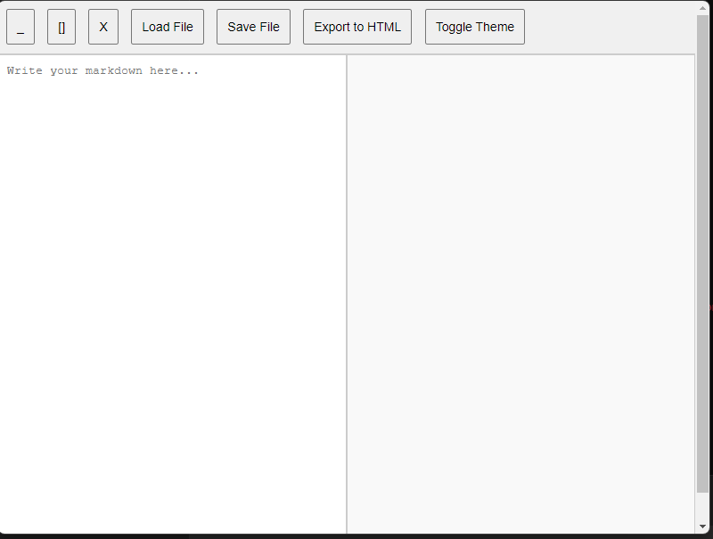

# Simple Markdown Editor

A lightweight Markdown editor built with Electron that provides real-time Markdown preview. It supports basic Markdown syntax and offers functionalities like loading and saving Markdown files.

## Features

- Real-time preview of Markdown content
- Load and save Markdown files
- Toggle between light and dark themes
- Minimalistic and user-friendly interface

## Screenshots

## Installation

### Prerequisites

Make sure you have [Node.js](https://nodejs.org/) and [npm](https://www.npmjs.com/) installed on your machine.

### Clone the repository
	git clone https://github.com/yourusername/simplemarkdowneditor.git
	cd simplemarkdowneditor

### Install dependencies

 	npm install
	npm install electron- --save-dev
	 
### Run the application
You can start the application in development mode by running:

 	npm start
		
### Building the application
To create a packaged version of the application, run:

	npm run build

This command will generate the application for the target platform, producing an executable file (e.g., .exe for Windows, .AppImage for Linux, .dmg for Mac) in the release(./dist) directory.

### Releases

Pre-built executables for Windows and Linux are available in the Releases section.

Windows: SimpleMarkdownEditor.Setup.1.0.0.exe
Linux: SimpleMarkdownEditor-1.0.0.AppImage

### Usage
Open the application.
Write or paste your Markdown text into the editor.
The preview will update in real-time.
Use the toolbar buttons to save your work or load existing Markdown files.

### License
This project is licensed under the MIT License - see the LICENSE file for details.

### Contributing
Contributions are welcome! Please feel free to submit a pull request or open an issue.

### Acknowledgments
Electron - Framework for building desktop applications with web technologies.
Marked - A markdown parser and compiler.
